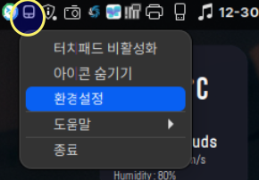
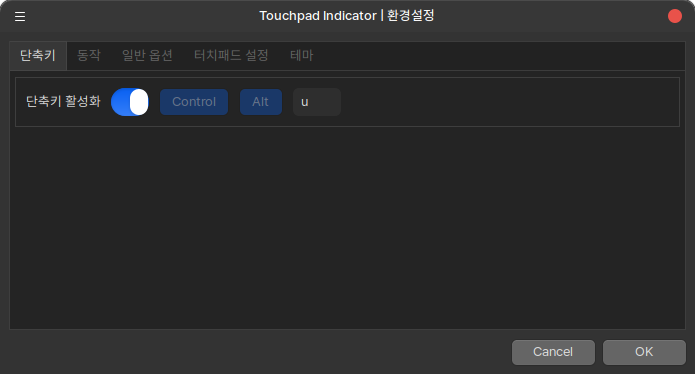
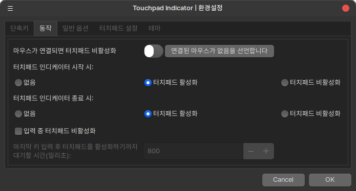
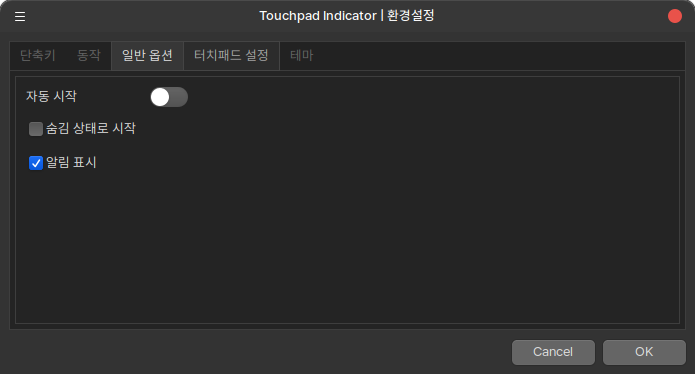
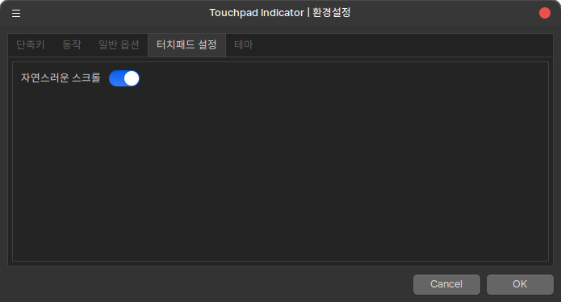
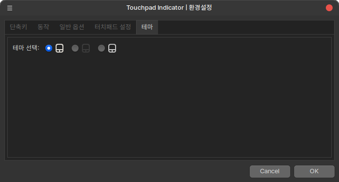

<h1 align="center">Touchpad-Indicator </h1>

## 프로젝트 소개

Touchpad-Indicator는 터치패드를 쉽게 활성화하거나 비활성화할 수 있는 도구입니다.

Touchpad-Indicator is a tool that allows you to easily enable or disable the touchpad.

- Upstream: https://github.com/hamonikr/touchpad-indicator

하모니카 8.0 또는 우분투 24.04 버전 지원 됩니다.

Supports HamoniKR 8.0 or later and Ubuntu 24.04 version.


### Install

Download the latest version from the [Releases](https://github.com/hamonikr/Touchpad-Indicator/releases) page.

```bash
sudo apt install -f ./touchpad-indicator_*.deb
```

### Usage

#### 프로그램 사용법 (Program Usage)

프로그램 실행 후 시스템 트레이에 터치패드 아이콘을 클릭하여 터치패드를 활성화하거나 비활성화할 수 있습니다.

After running the program, click on the touchpad icon in the system tray to enable or disable the touchpad.



## 스크린샷

단축키를 등록하면 쉽게 터치패드 상태를 활성화/비활성화 할 수 있습니다.

If you register a shortcut, you can easily enable or disable the touchpad state.












#### 시나몬 애플릿 사용법 (Cinnamon Applet Usage)

##### 자동 설치 (Automatic Installation)

제공된 설치 스크립트를 사용하여 애플릿을 설치할 수 있습니다:
(You can install the applet using the provided installation script:)

```bash
./install-cinnamon-applet.sh
```

설치가 완료되면 Cinnamon을 재시작(Alt+F2, 'r' 입력)한 후 애플릿을 추가할 수 있습니다.
(After installation, restart Cinnamon (Alt+F2, type 'r') and you can add the applet.)

##### 수동 설치 (Manual Installation)

1. 시나몬 메뉴 > 시스템 설정 > 애플릿으로 이동합니다.
   (Go to Cinnamon Menu > System Settings > Applets)

2. 다운로드 탭에서 "Touchpad Indicator" 를 찾아 패널에 추가합니다.
   (Find "Touchpad Indicator" in the Download tab and add it to the panel)

3. 패널에 추가된 터치패드 아이콘을 클릭하면 메뉴가 나타납니다:
   (Click the touchpad icon in the panel to show the menu:)
   - 터치패드 켜기 (Turn on touchpad)
   - 터치패드 끄기 (Turn off touchpad)
   - 현재 터치패드 상태 표시 (Shows current touchpad status)

4. 터치패드가 없는 시스템에서는 자동으로 비활성화됩니다.
   (On systems without a touchpad, it will be automatically disabled)